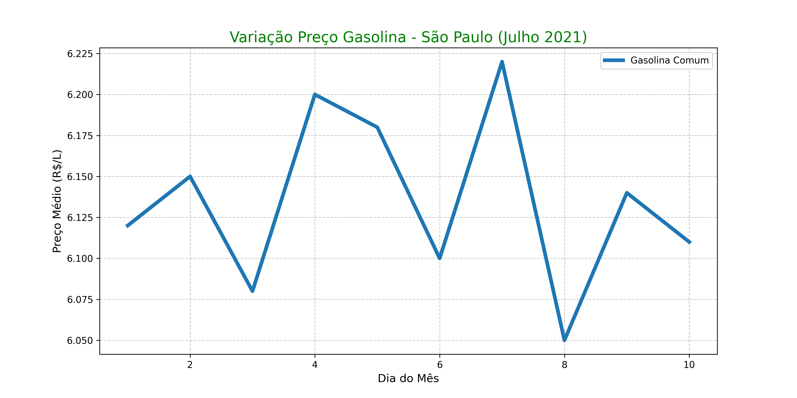

# EBAC123 - Exercícios EBAC

Repositório com entregas do curso EBAC (Git, Python, Pandas/Seaborn).

## Módulo 1-2
- Setup Git + Autenticação Colab
- Ex2: Análise preços gasolina SP Jul/2021 (CSV, gráfico PNG, código PY)

Preços médios ~R$6.10. Feito com Pandas/Seaborn.

Próximos módulos aqui!
